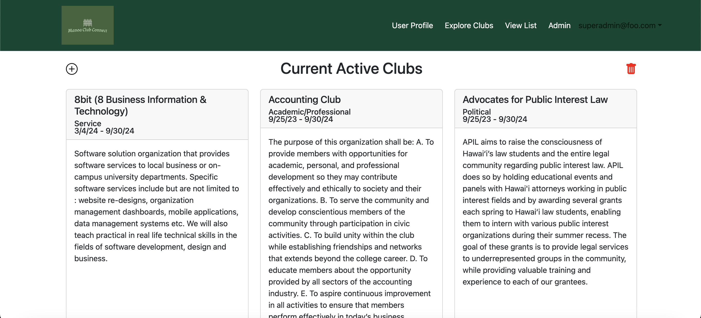

# Manoa Club Connect 
[Code Autonomy Organization](https://github.com/code-autonomy)
<br>
[Code Autonomy's team contract](https://docs.google.com/document/d/1vnaw9mUNz1EwLI1KBHjaXsj-FHBfhJIuC1sw3JntjSA/edit#heading=h.yb5x12fr8lu2)

## Table of contents
* [Overview](#overview)
* [Features](#features)
* [User Guide](#user-guide)
* [Developer Guide](#developer-guide)
* [Team](#team)
* [Mock-up Ideas](#mock-up-ideas)
* [Community Feedback](#community-feedback)
* [Deployment](#deployment)
* [Development History](#development-history)

# Overview

The project we chose to do was Manoa Club Connect. This website offers three distinct user roles, each authenticated via their UH ID. Standard users navigate through the directory, while Club Administrators possess the authority to modify their club's associated data. Super Administrators oversee the site's content integrity and selectively give "Club Administrator" privileges.

The platform goes beyond mere alphabetical club listings, enabling users to refine searches by interest categories such as athletics, arts, music, etc. Clubs can align with multiple interest categories.

Users have the option to specify their interest categories, receiving notifications when new clubs matching their preferences emerge or existing clubs incorporate those categories.

Administrators have the responsibility of monitoring the platform for inappropriate content and are empowered to introduce new categories reflecting musical preferences, capabilities, and objectives.

The Manoa Club Connects project utilizes GitHub for version control and collaboration, Meteor as the web framework, React for building user interfaces, and IntelliJ IDEA as the integrated development environment (IDE) for coding and development tasks. These technologies and resources facilitate efficient development and deployment of the project.

## Features
* **Roles** (users, admin): users can buy or sell goods and services, while administrators monitor user behavior and manage categories and other functionalities.
* **Categories**: feature broad categories for interests and services.
* **Notifications**: users can opt to receive information via text message.
* **Browse clubs**: Browse by interest area(s).
* **Photos**: supports upload of photos.
* **Complaints**: users can report inappropriate content or users.

# User Guide
The Manoa Club Connect website allows users for three level of users: user, admin, and superadmin. Regular users have access to the club categories page and a custom user profile page after signing in. Admins have access to their respective club's host page, where they can edit and update information accordingly. Super admins are able to view the entire list of clubs currently registered in the websites database, and may add more clubs or delete clubs who have not renewed their organization.

## Landing page
The landing page is presented to users when they visit the top-level URL to the site.
The carousel on this page cycles through the signin/signup and two other informational items.


After a user signs into their account, the first slide of the carousel changes to present the different pages.


## Sign In and Sign Up
From the landing page, when users click on the dropdown in the navbar or the button on the main slide of the carousel to either sign in or sign up, they will be taken to the respective pages to register their account or login into their existing account.


## Raw List of Clubs
This is a list of all the clubs in alphabetical order, for those who would rather see a full list of available clubs.


## Categories page
The Categories page provides a list of categories of topics for users to select from. Currently, there are over 50 clubs within the database that are displayed across the categories.


## User-Profile page
The User-Profile page displays user's information (username, profile picture, and bio).


## Club Admin home page
Once logged in, the Admin home page allows the admin to manage and moderate user accounts, services, and issues. By clicking on the edit icon under "Contact Email", the user will be redirected to a page to edit the information for the club.


## Announcements Page
The club admin will also have access to an announcements page, where they are able to create announcements and events that relate to their club.


## Admin page
The Notify admin page is a form for users to report any suspicious or inappropriate activities.


### Admin Add Club Form
From the admin page, the admin has the ability to add new clubs/organizations to the database via the plus icon.


### Remove Club Form
At the bottom of the admin page, admins can go to a page where they are able to remove inactive clubs.


# Developer Guide
This section will be a wlakthrough on how to download, install, run and modify the Manoa Club Connect system.
## Download and Install
To download the entire repository, go [here](https://github.com/code-autonomy/manoa-club-connect). It is recommended to use Github Desktop for a more fluid transition from Github to local. Once the repository has been cloned to your local environment, navigate to it through a terminal and cd into the /app directory. To install the necessary modules, run the following command:
```
$ meteor npm install
```
For good measure, you can also run the following command to ensure there are no ESlint errors:
```
$ meteor npm run lint
```

## Running the Application
Once the libraries are installed, the following command can be invoked to run the application:
```
$ meteor npm run start
```
This command should produce a similar output in the terminal:
```
[[[[[ ~/Desktop/Alchemy/Github/manoa-club-connect/app ]]]]]

=> Started proxy.                             
=> Started HMR server.                        
=> Started MongoDB.                           
I20240423-18:58:41.550(-10)? Creating the default user(s)
I20240423-18:58:41.582(-10)?   Creating user superadmin@foo.com.
I20240423-18:58:42.035(-10)?   Creating user admin@foo.com.
I20240423-18:58:42.182(-10)?   Creating user john@foo.com.
I20240423-18:58:42.289(-10)? Creating default Club.
I20240423-18:58:42.289(-10)?   Adding: 8bit (8 Business Information & Technology)
I20240423-18:58:42.327(-10)?   Adding: Accounting Club
I20240423-18:58:42.330(-10)?   Adding: Advocates for Public Interest Law
I20240423-18:58:42.332(-10)?   Adding: Addiction Medicine & Harm Reduction Interest Group
I20240423-18:58:42.335(-10)?   Adding: AECT- Hawaii at Manoa (AECT-HI)
I20240423-18:58:42.338(-10)?   Adding: Aikido at UHM
I20240423-18:58:42.340(-10)?   Adding: Alpha Omega Hawaii
I20240423-18:58:42.342(-10)?   Adding: Alpha Sigma Phi
I20240423-18:58:42.344(-10)?   Adding: Alpha Gamma Delta Delta Sigma
I20240423-18:58:42.346(-10)?   Adding: Alohathon
I20240423-18:58:42.347(-10)?   Adding: American Association of University Women at the University of Hawaiʻi at Mānoa
I20240423-18:58:42.349(-10)?   Adding: American Hotel & Lodging Association [AHLA]
I20240423-18:58:42.350(-10)?   Adding: American Institute of Aeronautics and Astronautics Student Branch at the University of Hawai'i at Manoa
I20240423-18:58:42.352(-10)?   Adding: American Institute of Graphic Arts at the University of Hawai'i at Manoa (AIGA UHM)
I20240423-18:58:42.354(-10)?   Adding: American Marketing Association at the University of Hawaii at Manoa
I20240423-18:58:42.355(-10)?   Adding: American Medical Association/Hawaii Medical Association Branch at JABSOM
I20240423-18:58:42.357(-10)?   Adding: American Society of Heating, Refrigerating and Air-Conditioning Engineers
I20240423-18:58:42.358(-10)?   Adding: American Society of Civil Engineers
I20240423-18:58:42.360(-10)?   Adding: American Institute of Architects Students Hawaii Chapter
I20240423-18:58:42.368(-10)?   Adding: American Library Association Student Chapter
I20240423-18:58:42.370(-10)?   Adding: Anakbayan Hawai‘i
I20240423-18:58:42.373(-10)?   Adding: Anthropology Undergraduate Student Association
I20240423-18:58:42.375(-10)?   Adding: Anime Manga Society of Hawai`i @ UH Manoa
I20240423-18:58:42.378(-10)?   Adding: Animal Science Club at UH Manoa
I20240423-18:58:42.380(-10)?   Adding: Asian-Pacific Law & Policy Journal
I20240423-18:58:42.382(-10)?   Adding: Associated Students of the John A. Burns School of Medicine
I20240423-18:58:42.384(-10)?   Adding: Association for Computing Machinery at the University of Hawaii at Manoa
I20240423-18:58:42.386(-10)?   Adding: ASD Student Group
I20240423-18:58:42.400(-10)?   Adding: Atherton YMCA
I20240423-18:58:42.404(-10)?   Adding: Aquaholics Scuba Club
I20240423-18:58:42.413(-10)?   Adding: Baptist Collegiate Ministries O'ahu
I20240423-18:58:42.418(-10)?   Adding: Bachelor of Social Work Organizations
I20240423-18:58:42.424(-10)?   Adding: Ballroom Dance Club @UH
I20240423-18:58:42.426(-10)?   Adding: Black Student Association
I20240423-18:58:42.429(-10)?   Adding: Be the Match
I20240423-18:58:42.431(-10)?   Adding: Best Buddies Chapter at UHM
I20240423-18:58:42.434(-10)?   Adding: Beta Alpha Psi - Delta Theta Chapter
I20240423-18:58:42.437(-10)?   Adding: Beta Beta Gamma
I20240423-18:58:42.439(-10)?   Adding: Botanical Society of America Hawaii Chapter at Univeristy of Hawaii at Manoa
I20240423-18:58:42.441(-10)?   Adding: Business Executive Society of Tomorrow
I20240423-18:58:42.445(-10)?   Adding: Capoeira Senzala Hawaii
I20240423-18:58:42.447(-10)?   Adding: Campus Chinese Christian Ministry
I20240423-18:58:42.451(-10)?   Adding: Chess Club at UH Manoa
I20240423-18:58:42.456(-10)?   Adding: Chi Alpha Hawaii
I20240423-18:58:42.459(-10)?   Adding: Chi Epsilon
=> Started your app.

=> App running at: http://localhost:3000/
```

The above output in the terminal is the initialization of the default users and clubs in the database.
## Modifying the database
There are two ways to modify the database:
1. Login with the superadmin role and add clubs via the admin page.
2. Navigate to the settings.development.json file and add values to the database so that they initialize with the other default values.

***It is worth noting that if you do make modifications to the default values of the clubs, they should match the schema found in the app/imports/api/club folder.***

## Team
Code Autonomy is designed, implemented, and maintained by Byron Soriano, Cristian Milanes, Luis Hernandez, Joshua Asuncion, and Eisen Oallesma.

# Mock-up Ideas
  * [User home page](#user-home-page)
  * [Matching Page](#matching-page)

## User home page
Once logged in, the User home page displays an overview of the user's interests/hobbies, and display of messages/notifications about users that match their interests.


## Matching page
The Matching page provides users with potential clubs to join based on the selected interests and hobbies.


# Community Feedback
We are always open to feedback on how we can improve the functionality of the website. The UH community are valued members of the Code Autonomy organization, and anything you have to say is important to us!

* "I like the design of the home page, it looks nice and feels comfortable to navigate. However, I feel like the "View List" page is a little redundant and underwhelming compared to the other pages."
* "The User Profile page needs a way to edit my profile. Some rows in the Explore Clubs page scroll while others don't. There are also no numbers or indicators to let me know how many pages to scroll through. Also the logo is kind of small. I do like the startrooper on the sign out screen."
* "I like the Baldur's Gate reference in the Explore Clubs page. The rows change heights though, and it kind of throws me off when I'm scrolling through the pages of each category. The user profile page also doesn't let me edit my profile."
* "All of the pages look nice, and it's very easy to navigate the website. I like that I can look through the clubs by their category, and that the profile page shows me what clubs align with my interests."
* "I like the Colors and style of the page, would enjoy it if it had a community page where people can chat about clubs and promote clubs. The sign out page is great it made me laugh." 

# Deployment
[Digital Ocean Deployment](https://manoa-club-connect.xyz/)

# Development History
[Milestone 1: Mock Up Development](https://github.com/orgs/code-autonomy/projects/4/views/1)

[Milestone 2: Deployment](https://github.com/orgs/code-autonomy/projects/8/views/2)

[Milestone3: Finale](https://github.com/orgs/code-autonomy/projects/9/views/1)
