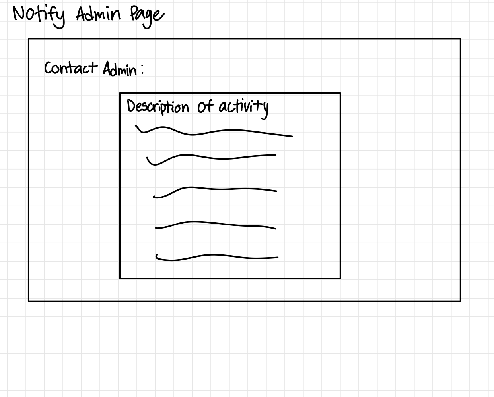

# Manoa Club Connect 
[Code Autonomy's team contract](https://docs.google.com/document/d/1vnaw9mUNz1EwLI1KBHjaXsj-FHBfhJIuC1sw3JntjSA/edit#heading=h.yb5x12fr8lu2)

## Table of contents
* [Overview](#overview)
* [Features](#features)
* [User Guide](#user-guide)
* [Team](#team)
* [Mock-up Ideas](#mock-up-ideas)
* [Developer Guide](#developer-guide)
* [Deployment](#deployment)
* [Development History](#development-history)

## Overview

The project we chose to do was Manoa Club Connect. This website offers three distinct user roles, each authenticated via their UH ID. Standard users navigate through the directory, while Club Administrators possess the authority to modify their club's associated data. Super Administrators oversee the site's content integrity and selectively give "Club Administrator" privileges.

The platform goes beyond mere alphabetical club listings, enabling users to refine searches by interest categories such as athletics, arts, music, etc. Clubs can align with multiple interest categories.

Users have the option to specify their interest categories, receiving notifications when new clubs matching their preferences emerge or existing clubs incorporate those categories.

Administrators have the responsibility of monitoring the platform for inappropriate content and are empowered to introduce new categories reflecting musical preferences, capabilities, and objectives.

The Manoa Club Connects project utilizes GitHub for version control and collaboration, Meteor as the web framework, React for building user interfaces, and IntelliJ IDEA as the integrated development environment (IDE) for coding and development tasks. These technologies and resources facilitate efficient development and deployment of the project.

## Features
* **Roles** (users, admin): users can buy or sell goods and services, while administrators monitor user behavior and manage categories and other functionalities.
* **Categories**: feature broad categories for interests and services.
* **Notifications**: users can opt to receive information via text message.
* **Browse clubs**: Browse by interest area(s).
* **Photos**: supports upload of photos.
* **Complaints**: users can report inappropriate content or users.

## User Guide
The Manoa Club Connect website allows users for three level of users: user, admin, and superadmin. Regular users have access to the club categories page and a custom user profile page after signing in. Admins have access to their respective club's host page, where they can edit and update information accordingly. Super admins are able to view the entire list of clubs currently registered in the websites database, and may add more clubs or delete clubs who have not renewed their organization.

## Team
Code Autonomy is designed, implemented, and maintained by Byron Soriano, Cristian Milanes, Luis Hernandez, Joshua Asuncion, and Eisen Oallesma.

## Mock-up Ideas
  * [Landing page](#landing-page)
  * [User home page](#user-home-page)
  * [Admin home page](#admin-home-page)
  * [User-Profile page](#user-profile-page)
  * [Categories page](#categories-page)
  * [Notify admin page](#notify-admin-page)

### Landing page
The landing page is presented to users when they visit the top-level URL to the site.
The carousel on this page cycles through the signin/signup and two other informational items.

After a user signs into their account, the first slide of the carousel changes to present the different pages.

### User home page
Once logged in, the User home page displays an overview of the user's interests/hobbies, and display of messages/notifications about users that match their interests.

### Club Admin home page
Once logged in, the Admin home page allows the admin to manage and moderate user accounts, services, and issues.

### User-Profile page
The User-Profile page displays user's information (username, profile picture, UH email, and bio).
=======
The User-Profile page displays user's information (username, profile picture, and bio).

### Categories page
The Categories page provides a list of categories of topics for users to select from.

### Matching page
The Matching page provides users with potential clubs to join based on the selected interests and hobbies.

### Notify admin page
The Notify admin page is a form for users to report any suspicious or inappropriate activities.

## Developer Guide
WIP

## Deployment
[Digital Ocean Deployment](http://64.23.210.170/)

## Development History
[Milestone 1: Mock Up Development](https://github.com/orgs/code-autonomy/projects/4/views/1)

[Milestone 2: Deployment](https://github.com/orgs/code-autonomy/projects/8/views/2)

<h4>Milestone 3: </h4>
=======
[Milestone 3:]()
 
=======
[Milestone 3:]()
 
WIP
